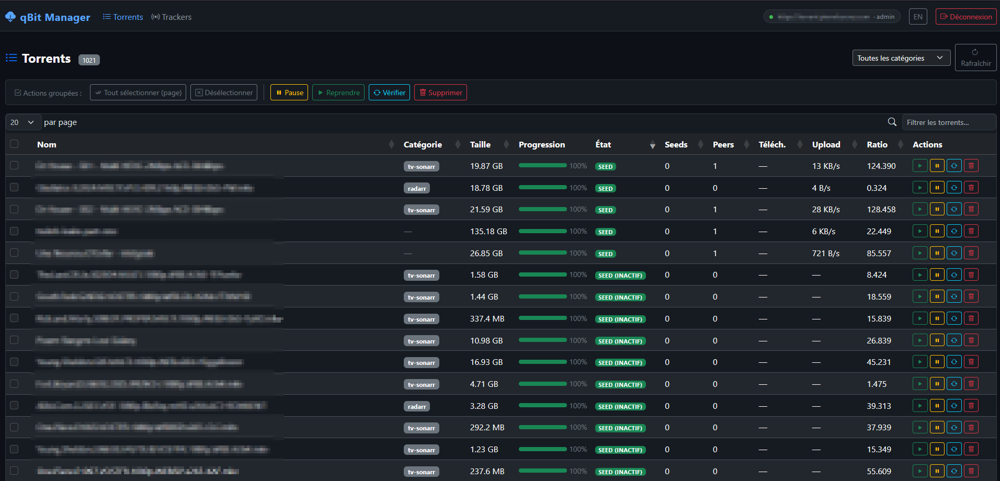
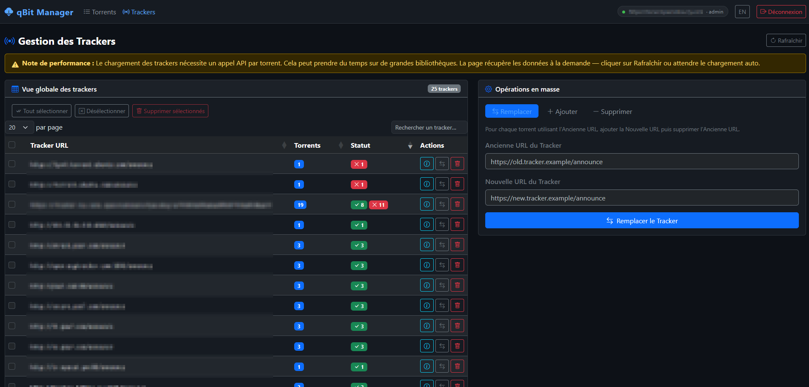

# qBittorrent Manager

Une interface web Flask légère pour gérer une instance qBittorrent à distance.

> 🇬🇧 [English version](README.en.md)

## Aperçu




## Fonctionnalités

- **Liste des torrents** — tableau paginé, triable et recherchable (DataTables côté serveur)
- **Actions sur les torrents** — pause, reprise, vérification, suppression (avec ou sans fichiers)
- **Vue des trackers** — liste de tous les trackers sur l'ensemble des torrents avec statut OK/erreur/en attente
- **Opérations en masse sur les trackers** — ajouter, remplacer ou supprimer une URL de tracker sur tous les torrents
- **Cache en arrière-plan** — la liste des torrents est mise en cache et rafraîchie automatiquement toutes les 30 secondes
- **Panneau détail** — clic sur un torrent pour afficher toutes ses informations dans un panneau latéral
- **Interface multilingue** — français par défaut, anglais disponible via le bouton FR/EN dans la barre de navigation (préférence sauvegardée dans le navigateur)
- **Dashboard** — vue d'ensemble avec vitesses globales, espace disque utilisé/disponible, graphique de vitesse en temps réel, répartition des torrents par état et par catégorie (nombre et espace disque)
- **Filtres persistants** — filtrer les torrents par état et par catégorie, filtrer les trackers par statut (OK / erreur / en attente) ; tri et filtres mémorisés dans le navigateur
- **Thème sombre / clair** — basculement via le bouton soleil/lune dans la navbar, préférence sauvegardée dans le navigateur
- **Priorité des fichiers** — menu déroulant par fichier dans le panneau détail (Ne pas télécharger / Normal / Haute / Maximum)
- **Mode debug** — activable depuis l'interface web (bouton 🐛 dans la navbar), affiche les logs détaillés dans la console sans redémarrer
- **Ajout de torrents** — ajouter un torrent via lien magnet/URL ou fichier .torrent, avec options catégorie, répertoire et démarrage en pause
- **Changement de catégorie** — modifier la catégorie d'un torrent directement depuis le panneau détail
- **Trackers dans le panneau détail** — liste des trackers avec icône de statut (actif / erreur / en attente)
- **Filtres intégrés au tableau** — filtres état et catégorie directement dans les en-têtes de colonnes
- **Vérification des mises à jour** — badge dans la navbar si une nouvelle version est disponible sur GitHub
- **Notifications navigateur** — alerte automatique quand un torrent atteint 100%
- **Liste des fichiers** — détail des fichiers d'un torrent avec taille et progression individuelle dans le panneau latéral

## Prérequis

- Python 3.10+
- Une instance qBittorrent avec l'interface Web activée

## Installation

```bash
git clone https://github.com/theOSCARP2/qbittorrent-manager.git
cd qbittorrent-manager
python -m venv .venv
source .venv/bin/activate  # Windows : .venv\Scripts\activate
pip install -r requirements.txt
```

## Utilisation

### Depuis les binaires (recommandé)

Télécharger le binaire correspondant à votre système depuis la page [Releases](https://github.com/theOSCARP2/qbittorrent-manager/releases) :

| Système | Fichier |
|---|---|
| Windows | `qbittorrent-manager.exe` |
| Linux | `qbittorrent-manager-linux` |
| macOS (Apple Silicon M1/M2/M3) | `qbittorrent-manager-macos-arm64` |
| macOS (Intel) | `qbittorrent-manager-macos-intel` |

**Windows** — double-cliquer sur le `.exe` ou l'exécuter depuis un terminal :
```bat
qbittorrent-manager.exe
```

**Linux / macOS** — rendre le fichier exécutable puis le lancer :
```bash
chmod +x qbittorrent-manager-linux  # ou qbittorrent-manager-macos-arm64 / qbittorrent-manager-macos-intel
./qbittorrent-manager-linux
```

### Depuis les sources

```bash
python app.py
```

Ouvrir [http://localhost:5000](http://localhost:5000) dans le navigateur, puis saisir l'URL de l'interface Web qBittorrent et les identifiants.

## Configuration

Au premier lancement, une clé secrète unique est automatiquement générée et sauvegardée dans `~/.qbittorrent-manager/secret.key`. Aucune action requise.

| Variable d'environnement | Description |
|---|---|
| `SECRET_KEY` | Surcharge la clé générée automatiquement (usage serveur, Docker, etc.) |

L'application utilise **Waitress** comme serveur de production (pas de warning de développement Flask).

## Crédits

Développé avec l'aide de [Claude](https://claude.ai) (Anthropic).

## Notes

- Compatible avec qBittorrent v5+ (endpoints `/api/v2/torrents/stop` et `start`, états `stoppedUP`/`stoppedDL` en remplacement de `pausedUP`/`pausedDL`)
- L'application ne stocke aucun identifiant — le cookie SID de qBittorrent est conservé uniquement dans la session Flask
